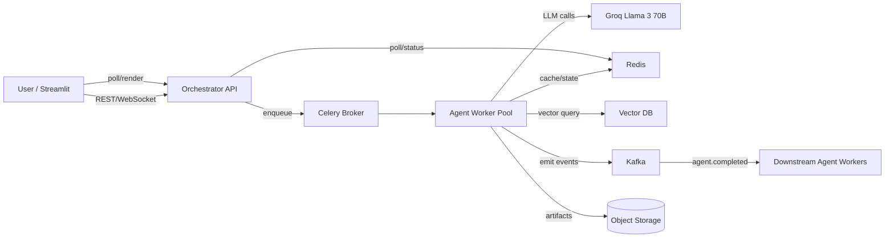

# System Architecture: Pharma Agentic AI

## Overview
The solution utilizes a **Multi-Agent Reference Architecture** (based on industry standards). It features a distinct **Orchestration Layer**, **Knowledge Layer**, **Storage Layer**, and **Agent Layer**. The system is built using **LangGraph** (or CrewAI) for orchestration and **Groq** for high-speed inference.

## Architecture Diagram

```mermaid
graph TD
    User[User / Pharma Planner] -->|Natural Language Query| Gateway[Gateway / User App]
    Gateway -->|Auth & Rate Limits| Orchestrator[Orchestration Layer\n(Master Agent)]
    
    subgraph "Orchestration Layer"
        Orchestrator -->|Intent Classification| Classifier[Classifier / Planner]
        Orchestrator -->|Registry Lookup| Registry[Agent Registry]
    end
    
    subgraph "Storage Layer"
        Orchestrator -->|Read/Write| History[Conversation History]
        Orchestrator -->|Read/Write| State[Agent State]
    end
    
    subgraph "Knowledge Layer"
        InternalAgent -->|RAG| VectorDB[(Vector DB / Internal Docs)]
        Orchestrator -->|Context| SourceBases[(Source Bases)]
    end
    
    subgraph "Agent Layer (Local & Remote)"
        Orchestrator -->|Delegate| Supervisor[Supervisor Agent]
        Supervisor -->|Task| IQVIA[IQVIA Insights Agent]
        Supervisor -->|Task| EXIM[EXIM Trends Agent]
        Supervisor -->|Task| Patent[Patent Landscape Agent]
        Supervisor -->|Task| Trials[Clinical Trials Agent]
        Supervisor -->|Task| InternalAgent[Internal Knowledge Agent]
        Supervisor -->|Task| Web[Web Intelligence Agent]
        Supervisor -->|Task| Social[Social Listening Agent]
        Supervisor -->|Task| Competitor[Competitor Agent]
    end
    
    subgraph "Integration Layer & MCP"
        IQVIA & EXIM & Patent & Trials & Web & Social & Competitor -->|MCP Protocol| Integration[Integration Layer]
        Integration -->|API Call| MockIQVIA[(IQVIA Mock API)]
        Integration -->|API Call| MockEXIM[(EXIM Mock Server)]
        Integration -->|API Call| MockUSPTO[(USPTO API Clone)]
        Integration -->|API Call| MockTrials[(Clinical Trials Stub)]
        Integration -->|Search| WebProxy[(Web Search Proxy)]
        Integration -->|Scrape| MockSocial[(Social Media Mock)]
        Integration -->|Query| MockComp[(Competitor Intel Mock)]
    end
    
    subgraph "Observability & Evals"
        Orchestrator & Supervisor & Integration -->|Traces/Logs| Observability[Observability / LangSmith]
        Observability -->|Feedback| Evaluation[Evaluation / Golden Tests]
    end

    subgraph "Output Layer"
        Orchestrator -->|Synthesized Data| Report[Report Generator Agent]
        Report -->|PDF/Excel| Gateway
        Orchestrator -->|Chat Response| Gateway
    end
```

## Core Layers

### 1. Orchestration Layer
- **Master Agent (Orchestrator)**: The central brain. Uses a "Semantic Kernel" or LangGraph state machine to manage the conversation flow.
- **Classifier**: Determines the intent (Market Analysis vs. Innovation Search).
- **Agent Registry**: Dynamic lookup of available worker agents and their capabilities.

### 2. Agent Layer
- **Supervisor Agent**: Manages the specific execution of sub-tasks, ensuring agents don't hallucinate or loop indefinitely.
- **Worker Agents**: Specialized agents (IQVIA, EXIM, Patent, etc.) that act as "MCP Clients" to fetch data.

### 3. Knowledge Layer
- **Vector DB**: Stores embeddings of internal strategy decks for the Internal Knowledge Agent.
- **Source Bases**: Raw text sources for grounding.

### 4. Storage Layer
- **Conversation History**: Persists the chat context.
- **Agent State**: Tracks the progress of long-running research tasks.

### 5. Integration Layer (MCP)
- **Model Context Protocol (MCP)**: Standardized interface for agents to talk to external tools (Mock APIs).
- **External Tools**: The actual mock data sources (JSON/CSV files wrapped in APIs).

### 6. Observability & Evals
- **Observability**: Tracing agent thought processes (LangSmith/LangFuse).
- **Evaluation**: Running "Golden Tasks" (e.g., "Find whitespace in India") to measure performance against expected outputs.

## Technology Stack
- **Framework**: LangGraph / CrewAI
- **LLM Engine**: Groq (Llama 3 70B / Mixtral) for speed.
- **Vector Store**: ChromaDB / FAISS.
- **Observability**: LangSmith or similar.
- **Protocol**: MCP (Model Context Protocol) for tool integration.

## Production-Ready Architecture Refactor

### Goals
- Handle many concurrent strategy requests without blocking the UI.
- Move long-running agentic work off the Streamlit/FastAPI process.
- Add durable state, retries, and event-driven agent collaboration.
- Cache expensive RAG lookups and protect Groq with rate limits.

### Service Decomposition & Communications
- **UI / API Gateway**: Streamlit for interactive UX; FastAPI for programmatic calls. Communicates with Orchestrator via REST (gRPC optional later).
- **Orchestrator API**: Plans jobs, issues Celery tasks, persists job metadata in Redis/Postgres, exposes `/jobs/{id}` for polling/streaming.
- **Agent Workers**: Celery workers running CrewAI `crew.kickoff()` or individual agent tasks; scale horizontally.
- **Data/RAG Service**: Vector DB (Chroma/PGVector) + Redis cache; optional ingestion/ETL service for periodic refresh.
- **Infra**: Redis (cache + job state + rate limits), Message Broker (RabbitMQ or Redis for Celery), Kafka for inter-agent events/telemetry, object storage for artifacts.
- **Protocols**: REST/gRPC for control plane; Celery queues for task dispatch; Kafka topics for agent events; Redis for cache/state; TLS + auth (JWT or service tokens) on all entry points.

### Async Pipeline (Streamlit → Orchestrator → Celery → Workers)
1. Streamlit sends `POST /jobs` with query/context to Orchestrator.
2. Orchestrator writes job metadata to Redis (`jobs:{job_id}`) and enqueues Celery task.
3. Celery worker runs CrewAI and streams/logs progress; intermediate results cached in Redis and optionally emitted to Kafka.
4. Streamlit polls `/jobs/{id}` or subscribes to Kafka/WebSocket for live updates; downloads final artifact/report when complete.

#### Celery + CrewAI task shape
```python
# src/infra/celery_app.py
from celery import Celery
from redis import Redis
from src.agents.master_agent import create_master_crew

celery_app = Celery(
    "pharma_agents",
    broker=os.getenv("CELERY_BROKER_URL", "redis://redis:6379/0"),
    backend=os.getenv("CELERY_BACKEND_URL", "redis://redis:6379/1"),
)
redis_client = Redis.from_url(os.getenv("REDIS_URL", "redis://redis:6379/0"), decode_responses=True)

@celery_app.task(bind=True, autoretry_for=(Exception,), retry_backoff=True, retry_kwargs={"max_retries": 3})
def run_agentic_job(self, job_id: str, query: str, context: dict | None = None):
    redis_client.hset(f"jobs:{job_id}", mapping={"status": "running"})
    crew = create_master_crew(query)
    result = crew.kickoff()  # long-running
    redis_client.hset(f"jobs:{job_id}", mapping={"status": "done", "result": str(result)})
    return str(result)
```

#### Orchestrator API endpoints (FastAPI sketch)
```python
# src/api/jobs.py
@router.post("/jobs")
async def submit_job(req: JobRequest):
    job_id = uuid4().hex
    redis_client.hset(f"jobs:{job_id}", mapping={"status": "queued"})
    run_agentic_job.delay(job_id=job_id, query=req.query, context=req.context)
    return {"job_id": job_id}

@router.get("/jobs/{job_id}")
async def get_status(job_id: str):
    meta = redis_client.hgetall(f"jobs:{job_id}")
    if not meta:
        raise HTTPException(status_code=404, detail="job not found")
    return meta
```

### Kafka for Inter-Agent Collaboration (prioritize event-driven option C)
- Use Kafka to decouple agent outputs from downstream triggers.
- Topics:
  - `agent.completed` (keyed by job_id, payload: agent name, summary, artifacts URI)
  - `agent.requested` (optional for orchestration audit)
  - `agent.telemetry` (high-volume logs/metrics)
- Flow: when Patent agent finishes, it publishes to `agent.completed`; Competitor/Strategy worker consumes and schedules follow-on tasks (either via Celery or direct async call).

#### Kafka producer/consumer sketch
```python
# Producer inside worker
payload = {"job_id": job_id, "agent": "patent", "summary": summary, "ts": time.time()}
await producer.send_and_wait("agent.completed", json.dumps(payload).encode())

# Consumer driving follow-on work
async for msg in consumer:
    event = json.loads(msg.value)
    if event["agent"] == "patent":
        run_agentic_job.delay(job_id=event["job_id"], query=f"Assess competitors based on {event['summary']}")
```

### Redis as Fast Cache/State
- **RAG hot cache**: key `rag:ctx:{hash(query)}` → serialized context, TTL 10–30 minutes to avoid repeat vector searches.
- **Agent scratchpad**: key `job:{job_id}:agent:{name}` → partial outputs for progressive disclosure.
- **Conversation/session**: use Redis streams or hashes keyed by user/session id.
- All cached entries tagged with TTL and size caps; fall back to vector DB on miss.

#### RAG cache wrapper
```python
def get_rag_context_cached(query: str):
    key = f"rag:ctx:{hashlib.sha256(query.encode()).hexdigest()}"
    cached = redis_client.get(key)
    if cached:
        return cached
    ctx = build_rag_context(query)  # existing vector/RAG call
    redis_client.setex(key, 1800, ctx)
    return ctx
```

### Groq Rate Limiting (Redis token bucket)
- Use Redis atomic script to enforce per-user and global QPS.
- Keys: `rl:groq:{user_id}` and `rl:groq:global`; values store tokens + timestamps.
```python
RATE = 5  # requests/sec/user
BURST = 10

def allow(user_id: str) -> bool:
    now = int(time.time())
    key = f"rl:groq:{user_id}"
    with redis_client.pipeline() as pipe:
        while True:
            try:
                pipe.watch(key)
                tokens, ts = map(int, (pipe.get(key) or f"{BURST}:{now}").split(":"))
                tokens = min(BURST, tokens + (now - ts) * RATE)
                if tokens <= 0:
                    return False
                pipe.multi()
                pipe.setex(key, 60, f"{tokens-1}:{now}")
                pipe.execute()
                return True
            except redis.WatchError:
                continue
```
Attach to Groq client wrapper; on deny, queue/retry or return 429.

### Deployment (Compose/K8s-ready)
- **Docker Compose (local)**: services `ui` (Streamlit), `orchestrator-api`, `celery-worker`, `celery-beat` (scheduled ingestions), `redis`, `rabbitmq` (or Redis as broker), `kafka`, `zookeeper`, `vector-db`.
- **Kubernetes**: Deployments per service; HPAs on `orchestrator-api` and `celery-worker`; StatefulSet for Kafka/Zookeeper or use managed Kafka; Redis as StatefulSet with persistence; use ConfigMaps/Secrets for env; Ingress for UI/API.
- **Reliability**: Celery retries/backoff, task timeouts, idempotent job IDs, DLQs (Celery + Kafka), circuit breakers around Groq calls, structured logging + metrics (Prometheus/OpenTelemetry).

### Updated Architecture Diagram (async/event-driven)
